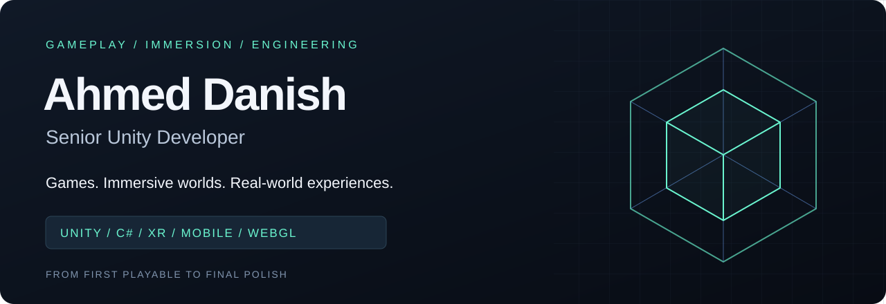

  

  <a href="https://danishdev.com"><b>Portfolio</b></a> &nbsp; / &nbsp;
  <a href="https://www.upwork.com/freelancers/~01279aea16e5d461a3"><b>Work with me</b></a> &nbsp; / &nbsp;
  <a href="https://www.linkedin.com/in/ahmeddanisharif"><b>LinkedIn</b></a> &nbsp; / &nbsp;
  <a href="mailto:ahmed1921@live.com"><b>Email</b></a>

 

### I turn ideas into experiences people can play.

I'm **Ahmed Danish**, a Unity developer with **9+ years of experience** building games, AR/VR applications, and interactive installations. My work spans mobile screens, Quest headsets, browsers, and live attractions—with a focus on responsive gameplay, reliable systems, and performance on real hardware.

I've contributed to experiences for **Universal Studios, Coca-Cola, Boeing, eBay, and AdventHealth**.

 

## Selected work

<table>
<tr>
<td width="50%" valign="top">
<h3>01 / Immersive experiences</h3>

<b>eBay Vault — VR</b> Contributed to the award-winning Vault Trials experience. <a href="https://shortyawards.com/16th/vault-trials">Explore the project →</a>

<b>NEI VR — See What I See</b> Healthcare VR experience exploring eye conditions. <a href="https://play.google.com/store/apps/details?id=gov.nih.neivr">View the application →</a>

<b>Boeing Touch</b> Real-time AR airplane detection.

</td>
<td width="50%" valign="top">
<h3>02 / Games &amp; live attractions</h3>

<b>USJ No-Limit Parade</b> Performance optimization for a live attraction at Universal Studios Japan.

<b>Coca-Cola Refresh Lounge</b> Interactive music kiosk at Universal Studios Orlando.

<b>WarStrike — FPS Shooter</b> Combat systems, weapons, and HUD. <a href="https://play.google.com/store/apps/details?id=com.gs360.warstrike.shooting.games">View the game →</a>

</td>
</tr>
</table>

<b>More projects</b> — puzzle RPGs, AR discovery, and interactive exhibits

- **Murasaki7** — Anime puzzle RPG with PvE / PvP.
- **Upblock** — Hyper-casual gameplay with runtime mesh cutting.
- **FinderShare** — Resort-based AR animal discovery. [Project website](https://www.findershare.com/)
- **OUC Powerplay** — Interactive 3D grid-based educational game.
- **Play-Doh Interactives** — Interactive installations for SEVEN, Saudi Arabia.
- **Car Wash: Auto Repair Garage** — Vehicle repair and customization gameplay.

 

## What I bring to a project

| Gameplay that feels right | Systems that hold up | Performance that ships |
| :--- | :--- | :--- |
| 2D / 3D mechanics, combat, UI, and progression | Reusable architecture, editor tools, multiplayer, and API integrations | Profiling, asset delivery, rendering, and device-specific optimization |

**My approach:** establish the core loop, get a playable build into your hands early, then refine the feel and performance through iteration.

 

## Engineering toolkit

| Focus | Tools & technologies |
| :--- | :--- |
| **Core & platforms** | Unity · C# · Android · iOS · WebGL · Desktop |
| **Immersive** | AR Foundation · OpenXR · Oculus / Meta Quest · Vuforia |
| **Gameplay & UI** | DOTween · Spine 2D · TextMeshPro · Canvas · UI Toolkit |
| **Rendering & performance** | URP / HDRP · Shader Graph · Jobs / Burst · Addressables |
| **Connected experiences** | Photon · Netcode for GameObjects · PlayFab · Firebase · REST APIs |
| **Workflow** | Git · Perforce · Jira · Editor tooling · Build pipelines |

 

## Explore the code

[**School VR Multiplayer**](https://github.com/ahmed1921/School-VR-Multiplayer) &nbsp; · &nbsp;
[**Color Fill 3D**](https://github.com/ahmed1921/Color-Fill-3D) &nbsp; · &nbsp;
[**SphereTest**](https://github.com/ahmed1921/SphereTest) &nbsp; · &nbsp;
[**pillpusher**](https://github.com/ahmed1921/pillpusher)

All public repository cards · automatically updated

<!-- REPO-GRID:START -->

&nbsp;

&nbsp;

  

&nbsp;

&nbsp;

<!-- REPO-GRID:END -->

<b>Experience &amp; learning</b>

| Studio | Period |
| :--- | :--- |
| X Studios · Orlando | 2023–Present |
| Open Dive · New York | 2022–2023 |
| NSTBG Manila Studio | 2020–2022 |
| Game District · Lahore | 2019 |
| Malistic Studio · Lahore | 2018 |
| Appricot Studio · Lahore | 2016–2018 |

**Courses & certifications:** RPG Core Combat Creator · Programming Design Patterns for Unity · Creating an RPG Game in Unity · Multiplayer VR Development with Unity · VR Development Fundamentals (Oculus).

---

### Have a game or immersive experience in mind?

Share the concept, target platform, and where development stands. I can help turn the next step into a playable build.

**[Discuss your project →](mailto:ahmed1921@live.com)** &nbsp; [View portfolio](https://danishdev.com) &nbsp; [Find me on Upwork](https://www.upwork.com/freelancers/~01279aea16e5d461a3)
