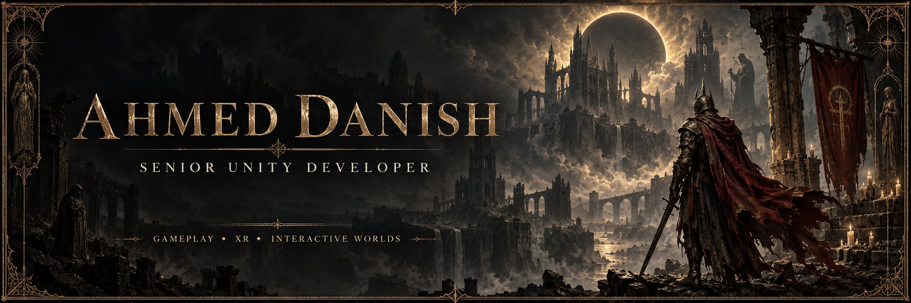
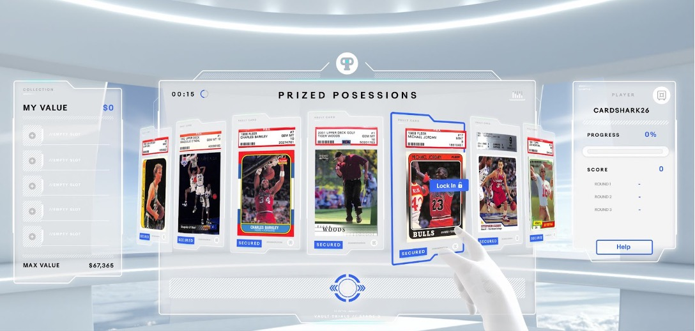
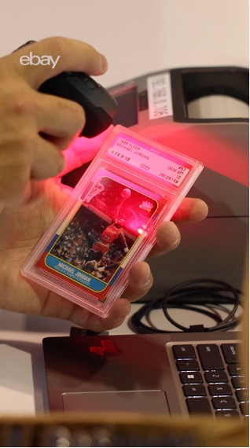
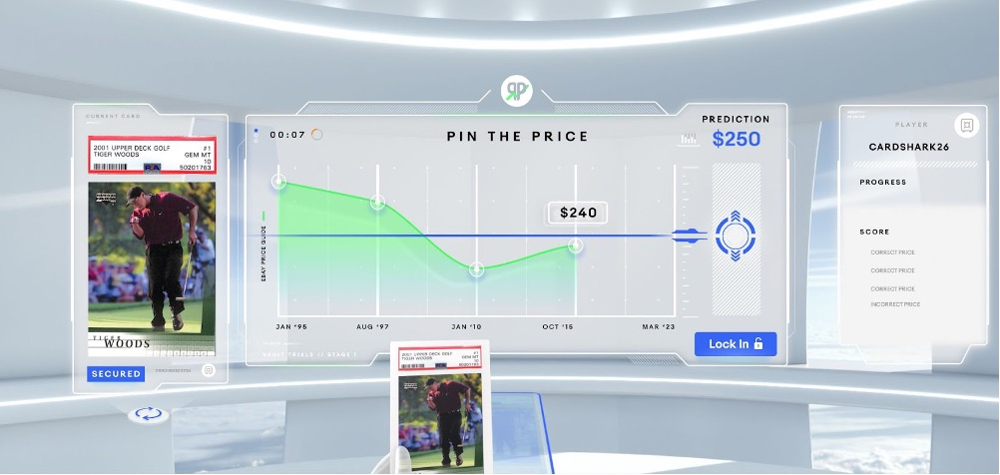
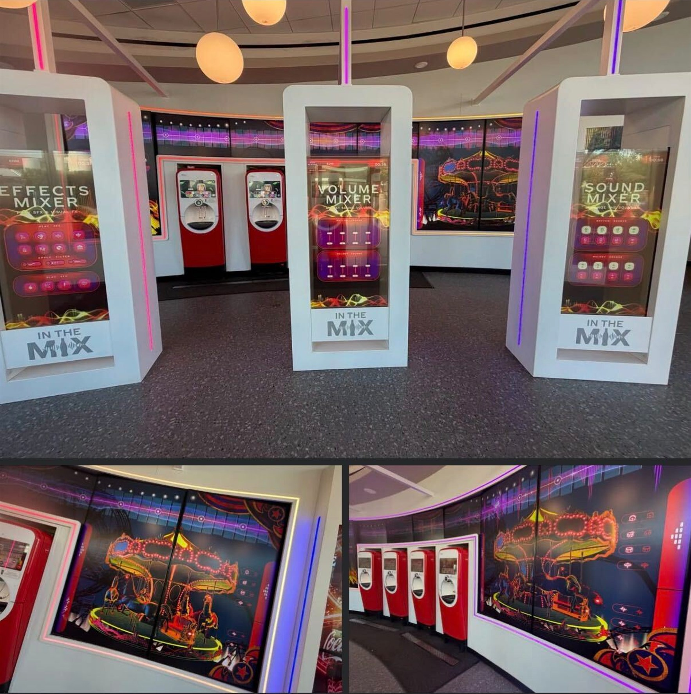

  

<h2 align="center">Make the first minute worth playing. Build the systems that carry the rest.</h2>

<b>9+ years in Unity · Gameplay engineering · AR / VR · Mobile &amp; WebGL</b>

<a href="#selected-work"><b>EXPLORE MY WORK</b></a> &nbsp; / &nbsp;
<a href="https://danishdev.com"><b>PORTFOLIO</b></a> &nbsp; / &nbsp;
<a href="https://www.linkedin.com/in/ahmed-danish/"><b>LINKEDIN</b></a> &nbsp; / &nbsp;
<a href="mailto:ahmed1921@live.com"><b>LET’S TALK</b></a>

---

### From “does it work?” to “one more round.”

I'm **Ahmed Danish**, a **Senior Unity Developer** building responsive gameplay, immersive worlds, and the systems behind them. I work across **2D / 3D games, mobile, WebGL, and XR**—from proving a core mechanic to improving an existing production build.

**Combat that responds. Interfaces that stay out of the way. Builds that perform on the target device.** That's where I put my engineering effort.

My project experience includes work for **Universal Studios, Coca-Cola, eBay, Boeing, and AdventHealth**.

| Building a game? | Hiring for your team? |
| :--- | :--- |
| I can turn a brief into a playable prototype, develop the remaining features, or tackle performance and build issues. | I bring hands-on Unity and C# experience across gameplay, XR, reusable systems, and existing codebases. |
| [Discuss your project →](https://www.upwork.com/freelancers/~01279aea16e5d461a3) | [Start a conversation →](mailto:ahmed1921@live.com) |

## Selected work

<a href="#ebay-vault"><b>01 · eBay Vault</b></a> &nbsp; | &nbsp; <a href="#coca-cola"><b>02 · Coca-Cola</b></a> &nbsp; | &nbsp; <a href="#more-selected-work"><b>More work ↓</b></a>

### eBay Vault · VR experience

Contributed to the award-winning Vault Trials experience. Explore the gameplay and physical card-scanning setup below.

<table>
<tr>
<td align="center" width="33%"> <b>01 · Prized Possessions</b></td>
<td align="center" width="33%"> <b>02 · Card scanning</b></td>
<td align="center" width="33%"> <b>03 · Pin the Price</b></td>
</tr>
</table>

<b>Expand all 3 photos</b>

#### 01 · Prized Possessions

#### 02 · Card scanning

#### 03 · Pin the Price

<a href="https://shortyawards.com/16th/vault-trials"><b>Explore the award-winning project →</b></a> &nbsp; | &nbsp; <a href="#coca-cola">Next project: Coca-Cola ↓</a>

---

### Coca-Cola Refresh Lounge · Universal Studios Orlando

Interactive music kiosks with effects, volume, and sound mixers.

<a href="https://www.tiktok.com/@walruscarp/video/7678091109360307486"><b>Watch video →</b></a> &nbsp; | &nbsp; <a href="assets/coca-cola-refresh-lounge.jpg">Open full-size photo</a> Video by @walruscarp

<b>Expand installation photo</b>

<a href="#ebay-vault">↑ Previous project: eBay Vault</a> &nbsp; | &nbsp; <a href="#more-selected-work">More work ↓</a>

---

<table>
<tr>
<td width="50%" valign="top">
<h3>01 / Immersive experiences</h3>

<b>NEI VR — See What I See</b> Healthcare VR experience exploring eye conditions. <a href="https://play.google.com/store/apps/details?id=gov.nih.neivr">View the application →</a>

<b>Boeing Touch</b> Real-time AR airplane detection.

</td>
<td width="50%" valign="top">
<h3>02 / Games &amp; live attractions</h3>

<b>USJ No-Limit Parade</b> Performance optimization for a live attraction at Universal Studios Japan.

<b>WarStrike — FPS Shooter</b> Combat systems, weapons, and HUD. <a href="https://play.google.com/store/apps/details?id=com.gs360.warstrike.shooting.games">View the game →</a>

</td>
</tr>
</table>

<b>More projects</b> — puzzle RPGs, AR discovery, and interactive exhibits

- **Murasaki7** — Anime puzzle RPG with PvE / PvP.
- **Upblock** — Hyper-casual gameplay with runtime mesh cutting.
- **FinderShare** — Resort-based AR animal discovery. [Project website](https://www.findershare.com/)
- **OUC Powerplay** — Interactive 3D grid-based educational game.
- **Play-Doh Interactives** — Interactive installations for SEVEN, Saudi Arabia.
- **Car Wash: Auto Repair Garage** — Vehicle repair and customization gameplay.

 

## What I bring to a project

| Gameplay that feels right | Systems that hold up | Performance that ships |
| :--- | :--- | :--- |
| 2D / 3D mechanics, combat, UI, and progression | Reusable architecture, editor tools, multiplayer, and API integrations | Profiling, asset delivery, rendering, and device-specific optimization |

**My approach:** establish the core loop, get a playable build into your hands early, then refine the feel and performance through iteration.

 

## Engineering toolkit

| Focus | Tools & technologies |
| :--- | :--- |
| **Core & platforms** | Unity · C# · Android · iOS · WebGL · Desktop |
| **Immersive** | AR Foundation · OpenXR · Oculus / Meta Quest · Vuforia |
| **Gameplay & UI** | DOTween · Spine 2D · TextMeshPro · Canvas · UI Toolkit |
| **Rendering & performance** | URP / HDRP · Shader Graph · Jobs / Burst · Addressables |
| **Connected experiences** | Photon · Netcode for GameObjects · PlayFab · Firebase · REST APIs |
| **Workflow** | Git · Perforce · Jira · Editor tooling · Build pipelines |

 

## Explore the code

[**School VR Multiplayer**](https://github.com/ahmed1921/School-VR-Multiplayer) &nbsp; · &nbsp;
[**Color Fill 3D**](https://github.com/ahmed1921/Color-Fill-3D) &nbsp; · &nbsp;
[**SphereTest**](https://github.com/ahmed1921/SphereTest) &nbsp; · &nbsp;
[**pillpusher**](https://github.com/ahmed1921/pillpusher)

All public repository cards · automatically updated

<!-- REPO-GRID:START -->

&nbsp;

&nbsp;

  

&nbsp;

&nbsp;

<!-- REPO-GRID:END -->

<b>Experience &amp; learning</b>

| Studio | Period |
| :--- | :--- |
| X Studios · Orlando | 2023–Present |
| Open Dive · New York | 2022–2023 |
| NSTBG Manila Studio | 2020–2022 |
| Game District · Lahore | 2019 |
| Malistic Studio · Lahore | 2018 |
| Appricot Studio · Lahore | 2016–2018 |

**Courses & certifications:** RPG Core Combat Creator · Programming Design Patterns for Unity · Creating an RPG Game in Unity · Multiplayer VR Development with Unity · VR Development Fundamentals (Oculus).

---

### Your next milestone should be playable.

Building something new, finishing an existing game, or hiring a Unity developer? Send me the platform, current build stage, and the next problem you need solved.

**[Discuss your project →](mailto:ahmed1921@live.com)** &nbsp; [View portfolio](https://danishdev.com) &nbsp; [Find me on Upwork](https://www.upwork.com/freelancers/~01279aea16e5d461a3)
