

  

  <a href="#skills-reel"><b>SKILLS REEL</b></a> &nbsp; / &nbsp;
  <a href="#selected-work"><b>SELECTED WORK</b></a> &nbsp; / &nbsp;
  <a href="#explore-the-code"><b>EXPLORE THE CODE</b></a> &nbsp; / &nbsp;
  <a href="https://danishdev.com"><b>PORTFOLIO</b></a> &nbsp; / &nbsp;
  <a href="mailto:ahmed1921@live.com"><b>LET’S TALK</b></a>

<!-- SKILLS-REEL:START -->
## Skills reel

<table width="100%">
<tr>
<td width="62%" valign="top">

</td>
<td width="38%" align="center" valign="top">
<h3>25-second skills reel</h3>
<a href="https://raw.githubusercontent.com/ahmed1921/ahmed1921/main/assets/ahmed-danish-skills-reel-25s.mp4">
  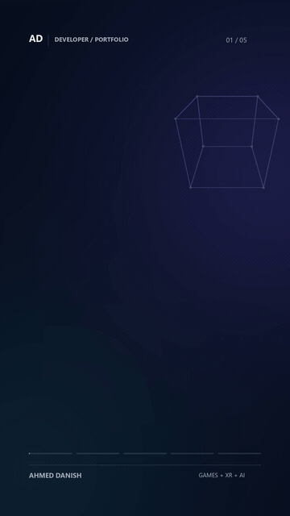
</a>

<a href="https://raw.githubusercontent.com/ahmed1921/ahmed1921/main/assets/ahmed-danish-skills-reel-25s.mp4"><b>Download the silent MP4 →</b></a>

</td>
</tr>
<tr>
<td width="62%" valign="top">
<h3>9+ years building games &amp; XR</h3>

<b>Senior Unity Developer · X Studios</b> 
Games, AR/VR and interactive attractions for PC, mobile and WebGL.

<b>Core expertise</b> 
Unity · C# · Gameplay &amp; UI 
AR Foundation · OpenXR · Meta Quest 
Multiplayer · PlayFab · Firebase 
Performance optimization · AI tooling

</td>
<td width="38%" valign="top">

<b>Selected work</b> 
<a href="#ebay-vault">eBay Vault Trials</a> — VR gameplay 
<a href="#coca-cola">Coca-Cola Refresh Lounge</a> — music kiosks 
<a href="#more-work">Universal Studios Japan</a> — optimization

<b>Previous roles</b> 
NSTBG Manila Studio · 2020–2022 
Game District · 2019

<b>Top Rated on Upwork</b> 
100% Job Success · 57 jobs · ~5,700 hours

<a href="https://danishdev.com"><b>Explore my portfolio →</b></a> 
<a href="mailto:ahmed1921@live.com">Let’s talk</a>

</td>
</tr>
</table>

<!-- SKILLS-REEL:END -->



<b>Full engineering toolkit</b>

| Focus | Tools & technologies |
| :--- | :--- |
| **Core & platforms** | Unity · C# · PC · Android · iOS · WebGL · 2D/3D development |
| **Gameplay & UI** | Gameplay systems · UI Toolkit · Canvas · TextMeshPro · DOTween · Spine 2D · Editor tools |
| **Architecture & quality** | Modular, event-driven systems · Unit/integration tests · Code reviews |
| **XR** | AR Foundation · OpenXR · Meta Quest · Vuforia |
| **Performance** | Unity Profiler · Frame Debugger · CPU/GPU and memory optimization · Addressables · URP/HDRP · Shader Graph · Jobs/Burst |
| **Networking** | Netcode for GameObjects · Photon · PlayFab · Firebase · State synchronization · Client-server APIs |
| **Workflow** | Git · Perforce · Jira · CI/CD builds · Technical documentation · Cross-platform deployment |
| **Game AI & inference** | AI NPCs · Speech-to-text / text-to-speech · Unity Inference Engine (Sentis) · ONNX |
| **LLM & tooling** | Tool calling · Structured outputs · RAG · Embeddings · Semantic search · Evaluation and fallback design · MCP and Unity editor automation |

 



## Selected work

  <a href="#ebay-vault"><b>eBay Vault</b></a> &nbsp; / &nbsp;
  <a href="#coca-cola"><b>Coca-Cola</b></a> &nbsp; / &nbsp;
  <a href="#play-doh-ground-control"><b>Play-Doh</b></a> &nbsp; / &nbsp;
  <a href="#more-work"><b>More work</b></a>

<table>
<tr>
<td width="50%" valign="top">

<h3>eBay Vault · VR experience</h3>
<a href="https://shortyawards.com/16th/vault-trials">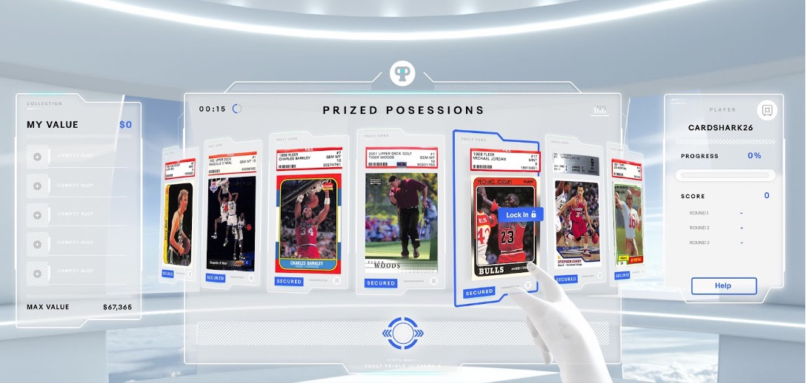</a>

Contributed to the award-winning <b>Vault Trials</b> experience, with VR gameplay and physical card scanning.

<a href="https://shortyawards.com/16th/vault-trials"><b>Explore the project →</b></a>
</td>
<td width="50%" valign="top">

<h3>Coca-Cola Refresh Lounge</h3>
<a href="https://www.tiktok.com/@walruscarp/video/7678091109360307486">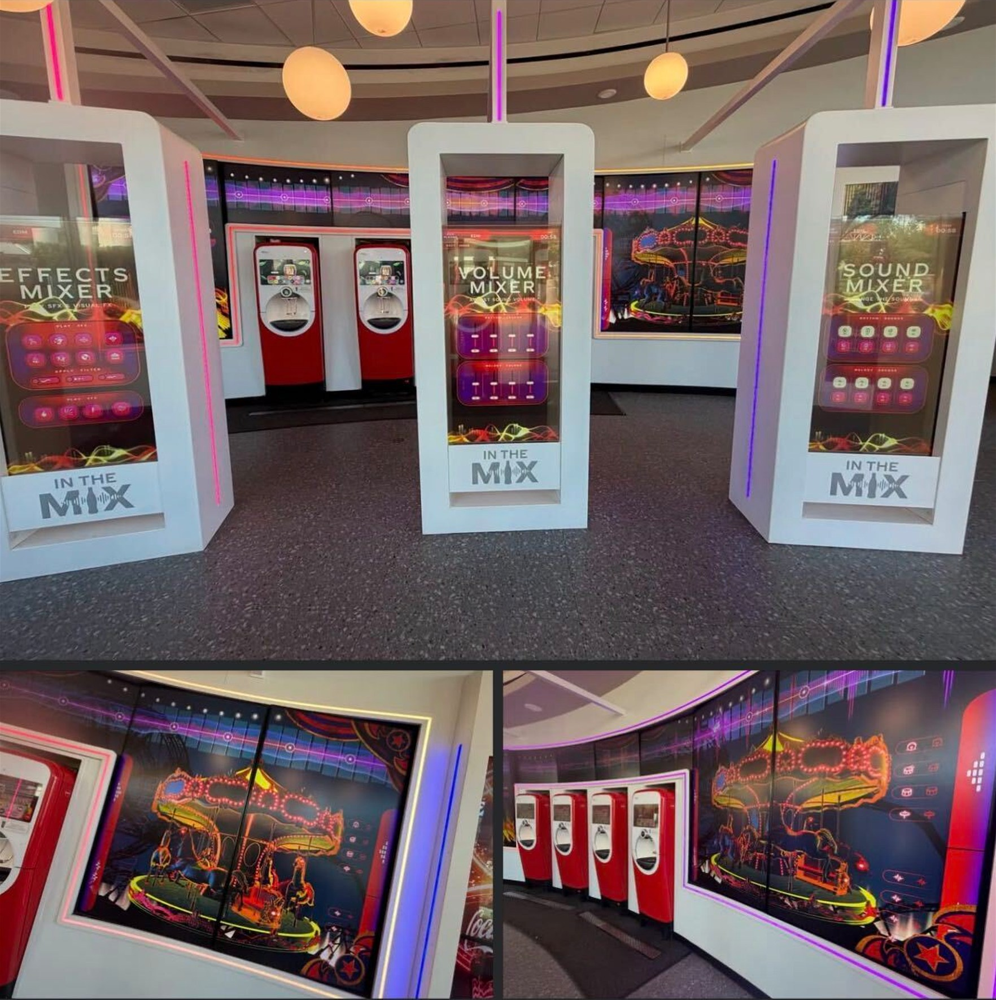</a>

Interactive music kiosks at <b>Universal Studios Orlando</b>, with effects, volume and sound mixers.

<a href="https://www.tiktok.com/@walruscarp/video/7678091109360307486"><b>Watch the installation →</b></a> 
Video by @walruscarp
</td>
</tr>
</table>

<b>eBay Vault photo gallery</b> — gameplay and physical card scanning

<table>
<tr>
<td width="33%" align="center"> <b>Prized Possessions</b></td>
<td width="33%" align="center"><a href="assets/ebay-vault-card-scanning.jpg">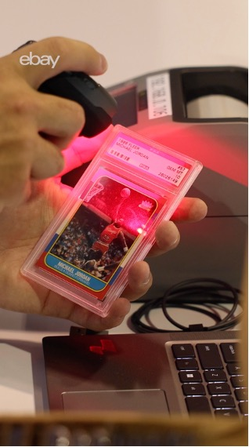</a> <b>Card scanning</b></td>
<td width="33%" align="center"><a href="assets/ebay-vault-pin-the-price.jpg">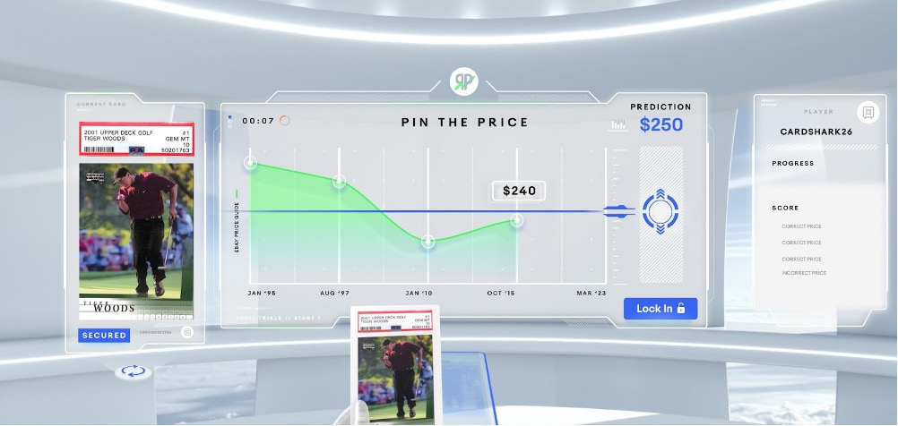</a> <b>Pin the Price</b></td>
</tr>
</table>

### Play-Doh Ground Control · Doha Interactive

**Create a character. Bring it to life. Share the adventure.**

A cluster of interconnected game stations where kids design their own characters and animals, then bring those creations to life across shared game screens.

<a href="assets/play-doh-ground-control-overview.jpg">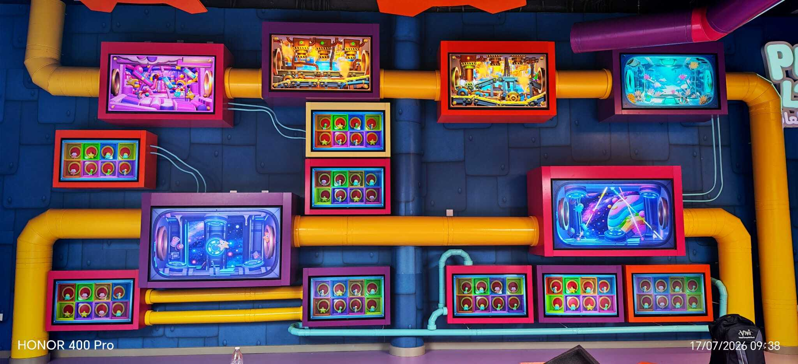</a>

<b>See the installation up close</b>

<a href="assets/play-doh-ground-control-detail.jpg">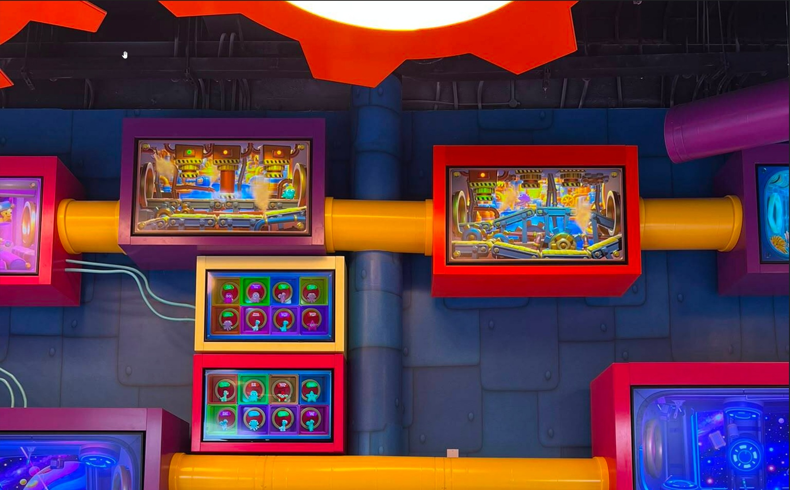</a>

### More games, XR and installations

| Project | My contribution / experience |
| :--- | :--- |
| **WarStrike — FPS Shooter** | Implemented combat, weapons and HUD for a game with **10M+ downloads**. [View game](https://play.google.com/store/apps/details?id=com.gs360.warstrike.shooting.games) |
| **Car Wash** | Developed a 2D kids’ car wash game with **10M+ downloads**. |
| **NEI VR — See What I See** | Healthcare VR experience exploring eye conditions. [View application](https://play.google.com/store/apps/details?id=gov.nih.neivr) |
| **USJ No-Limit Parade** | Performance optimization for a live attraction at Universal Studios Japan. |
| **Boeing Touch** | Real-time AR airplane detection. |
| **Murasaki7** | Built puzzle mechanics and UI for a PvE / PvP RPG with 200+ levels. |
| **OUC PowerPlay** | Built a 3D isometric game connecting buildings to the power grid. |
| **Upblock** | Built a 3D hypercasual game where players stack plane meshes. |
| **FinderShare** | Developed a resort-based AR adventure. [Project website](https://www.findershare.com/) |
| **Play-Doh Interactives** | Created interactive games for SEVEN entertainment destinations in Saudi Arabia. |
| **Operation Unity** | Built educational mini-games for AdventHealth. |

## Explore the code

Production client work and public repositories cover different parts of my work. Here are the public projects you can explore directly.

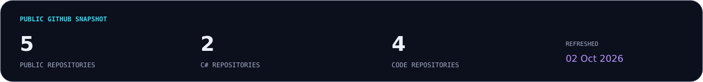

<!-- REPO-GRID:START -->
<table>
<tr>
<td width="50%"><a href="https://github.com/ahmed1921/School-VR-Multiplayer">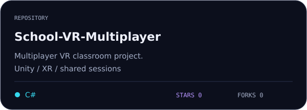</a></td>
<td width="50%"><a href="https://github.com/ahmed1921/Color-Fill-3D">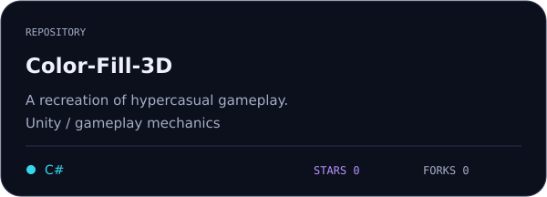</a></td>
</tr>
<tr>
<td width="50%"><a href="https://github.com/ahmed1921/pillpusher">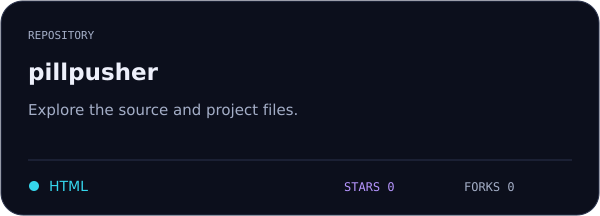</a></td>
<td width="50%"><a href="https://github.com/ahmed1921/SphereTest">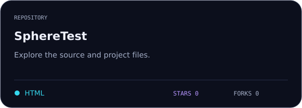</a></td>
</tr>
</table>
<!-- REPO-GRID:END -->

<a href="https://github.com/ahmed1921?tab=repositories"><b>Browse all repositories →</b></a>

## Contribution city

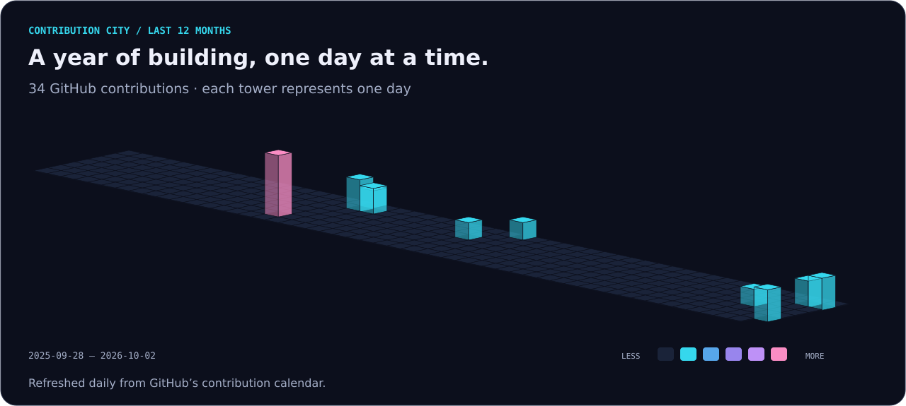

<b>Experience &amp; development</b>

| Role | Organization | Period |
| :--- | :--- | :--- |
| Senior Unity Developer | X Studios · Orlando | Mar 2023–Present |
| Senior Unity Developer | Upwork · Independent client projects | — |
| Senior Unity Developer | NSTBG Manila Studio | Jun 2020–Jun 2022 |
| Senior Game Developer | Game District · Lahore | Mar–Dec 2019 |

**Courses & certifications:** RPG Core Combat Creator · Programming Design Patterns for Unity · Creating an RPG Game in Unity · Multiplayer VR Development with Unity · VR Development Fundamentals (Oculus).

 

<a href="mailto:ahmed1921@live.com"></a>

  <a href="https://danishdev.com"><b>PORTFOLIO</b></a> &nbsp; / &nbsp;
  <a href="https://www.linkedin.com/in/ahmed-danish/"><b>LINKEDIN</b></a> &nbsp; / &nbsp;
  <a href="https://www.upwork.com/freelancers/~01279aea16e5d461a3"><b>UPWORK</b></a> &nbsp; / &nbsp;
  <a href="mailto:ahmed1921@live.com"><b>EMAIL</b></a>

